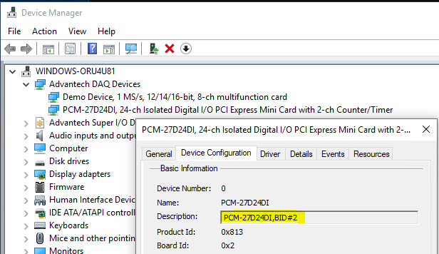

# node-atdaqnavi-dio
Node.js Integration for Advantech IIoT iDoor DIO module.

Notice that an Advantech iDoor Driver and SDK have to be installed to make this node works correctly.
Advantech iDoor Driver and SDK download link is shown below:
  https://www.advantech.tw/products/58fb7ea6-15fe-448d-b6f1-575bbbab2bfb/pcm-27d24di/mod_12e14877-e242-46e7-9ed6-f84f8ef64f13


## Installation
Use npm command to install this package locally in the Node-RED modules directory
``` bash
npm install node-atdaqnavi-dio
```
or install it globally with the command
```bash
npm install node-atdaqnavi-dio -g
```


## Usage
iDoor DIO package provides the following functions:
 - Get DI and DO status


## Example
Please refer to [`demo.js`](./demo.js).

All these examples are started with:
```js
var atdaqnavidio = require('node-atdaqnavi-dio');
```

### Get DI and DO status
Print platform module ID
```js
console.log(atdaqnavidio.get("PCM-27D24DI,BID#0"));
```
"PCM-27D24DI,BID#0" is a string depend on your system or hardware setting. You can get the string in device manager of Windows.
  

## Tested Platform
- Windows 10 Enterprise LTSC with node.js 10.19.0


## History
- 1.0.0 - March 2020 : Initial Release

## License
Copyright 2020 ADVANTECH Corp. under [the Apache 2.0 license](LICENSE).
